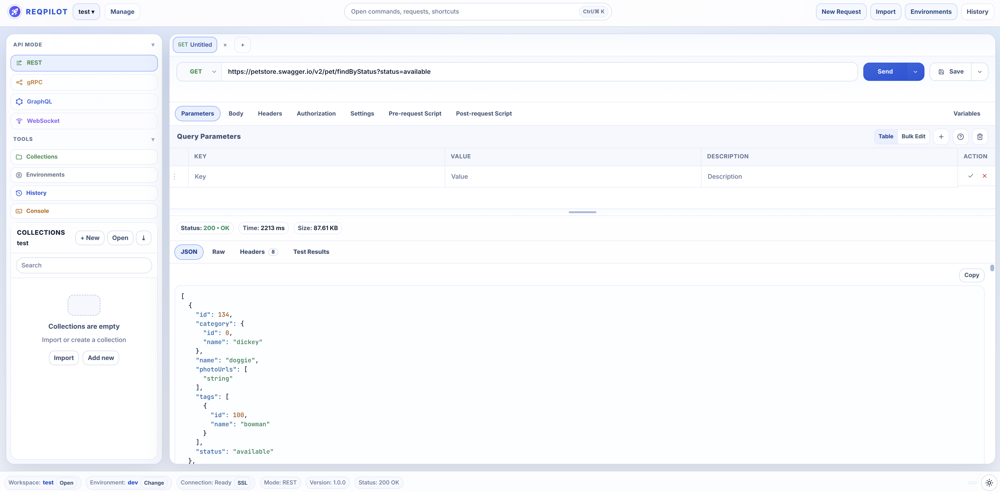

# ReqPilot

[](https://github.com/toolstackhq/reqpilot/actions/workflows/ci-build.yml)
[](https://github.com/toolstackhq/reqpilot/actions/workflows/ci-tests.yml)
[](https://github.com/toolstackhq/reqpilot/actions/workflows/docs-pages.yml)
[](https://codecov.io/gh/toolstackhq/reqpilot)
[](./LICENSE)
[](https://www.npmjs.com/package/@toolstackhq/reqpilot)
[](https://www.npmjs.com/package/@toolstackhq/reqpilot)
[](https://github.com/toolstackhq/reqpilot/releases)
[](https://github.com/toolstackhq/reqpilot/commits/main)

ReqPilot is a local-first REST API client for building requests, testing APIs, managing environments, and organizing collections/workspaces.

> Data stays on your system. ReqPilot does not host your payloads in the cloud, and request execution remains under your control.



## Run

```bash
npx @toolstackhq/reqpilot
```

ReqPilot starts at `http://localhost:5489`.

## Docs

- Live Docs: [here](https://toolstackhq.github.io/reqpilot/)

## Current WIP

- gRPC / GraphQL / WebSocket tabs are placeholders.
- Git workspace flow is active and still evolving.
