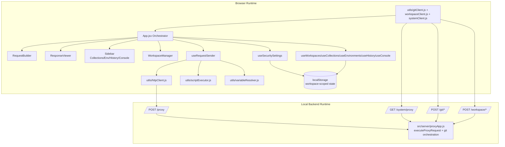
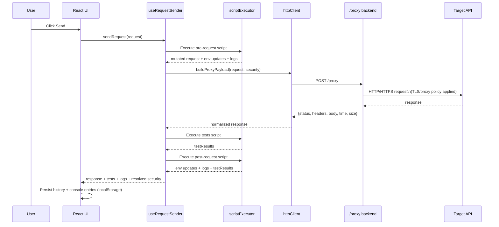
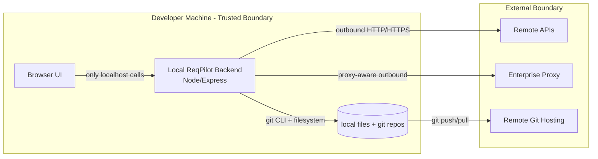

# Architecture

This diagram set reflects the current ReqPilot implementation (`React SPA + Node/Express local backend`) and is suitable for enterprise technical review.

## 1. System Context

```mermaid
flowchart LR
    User[Developer / QA / SRE]\n(Browser)] --> SPA[ReqPilot React SPA\nVite-built UI]

    SPA --> LS[(Browser localStorage)]
    SPA --> API[ReqPilot Local Backend\nNode + Express\nhttp://localhost:5489]

    API --> EXT[Target APIs\nREST endpoints]
    API --> PROXY[Corporate Proxy\nHTTP_PROXY / HTTPS_PROXY / NO_PROXY]
    API --> GIT[Git CLI]

    GIT --> LOCALREPO[Local Git Workspace\n~/.reqpilot/workspaces/*]
    GIT --> REMOTE[Remote Git Host\nGitHub / GitLab / Bitbucket]

    API -. optional .-> MOCK[Local Mock API\nhttp://localhost:4444]
```

## 2. Container / Component View



## 3. Request Execution Sequence



## 4. Security and Trust Boundaries



## 5. Backend API Surface (Current)

| Endpoint | Method | Purpose |
|---|---|---|
| `/proxy` | POST | Execute outbound API request with TLS/proxy settings |
| `/health` | GET | Backend health probe |
| `/system/proxy` | GET | Read masked system proxy environment values |
| `/git/status` | POST | Git status for workspace repo |
| `/git/fetch` | POST | `git fetch --all --prune` |
| `/git/pull` | POST | `git pull --rebase --autostash` with conflict signaling |
| `/git/add` | POST | `git add -A` |
| `/git/commit` | POST | `git commit -m` |
| `/git/push` | POST | `git push` |
| `/workspace/bootstrap` | POST | Create managed workspace layout and initialize repo |
| `/workspace/set-remote` | POST | Configure `origin` remote URL |
| `/workspace/publish` | POST | Stage + optional commit + push |

## 6. Non-Functional Characteristics

- Local-first persistence: browser `localStorage` by workspace for requests, collections, envs, history, console, security settings.
- No server-side database dependency in current architecture.
- Enterprise network compatibility via backend-side proxy support (`ProxyAgent`) and request-level proxy overrides.
- TLS control at global + host + request scope, including optional CA/client cert/key/passphrase.
- Collaboration model: Git-native workspace sync via backend git command wrappers.

